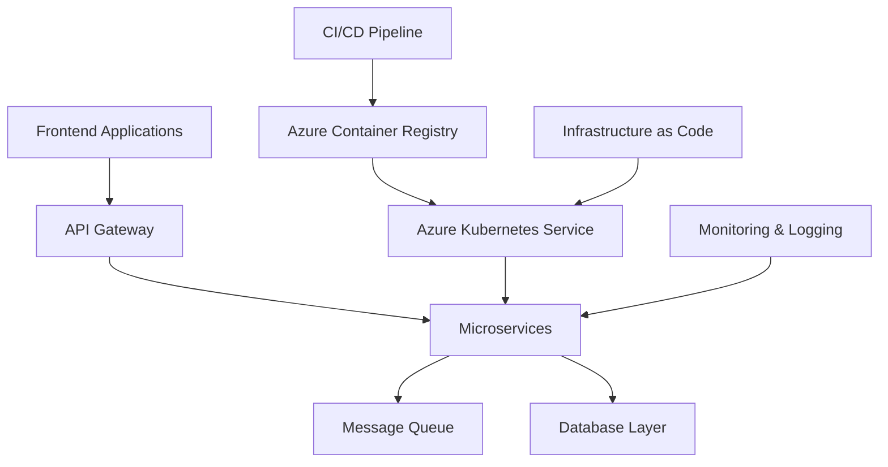

# Hi there, I'm @CollinsMunene👋

  

## 🚀 About Me

- 👀 I'm passionate about **large-scale system architecture**, **cloud infrastructure**, and **DevOps automation**
- 🌱 I'm currently exploring **advanced Azure services**, **microservices patterns**, and **AI/ML integration**
- 💞️ I'm looking to collaborate on **enterprise-grade applications**, **cloud migrations**, and **DevOps transformation projects**
- 📫 How to reach me: **[Your Email]** | **[LinkedIn]** | **[Portfolio Website]**
- 😄 Pronouns: **[Your Pronouns]**
- ⚡ Fun fact: **I love optimizing CI/CD pipelines and can spend hours fine-tuning deployment strategies!**

---

## 🛠️ Tech Stack & Expertise

### 💻 Programming Languages

  
  
  
  
  

### 🎯 Frameworks & Runtime

  
  
  
  
  
  
  
  

### ☁️ Cloud & DevOps (Azure Certified)

  
  
  
  
  
  

### 🔧 DevOps & Infrastructure

  
  
  
  
  
  
  
  

### 🗄️ Databases

  
  
  
  
  

### 🔍 Monitoring & Observability

  
  
  
  
  

### 🛠️ Tools & IDEs

  
  
  
  
  

---

## 🏆 Certifications & Achievements

  
  

---

## 📊 GitHub Analytics

  
  

  

---

## 🏗️ Architecture Approach

---

## 🤝 Let's Connect!

  
  
  
  

---

  

  <i>⚡ "Building scalable systems and automating the impossible, one commit at a time!" ⚡</i>

<!---
cm-collins/cm-collins is a ✨ special ✨ repository because its `README.md` (this file) appears on your GitHub profile.
You can click the Preview link to take a look at your changes.
--->
