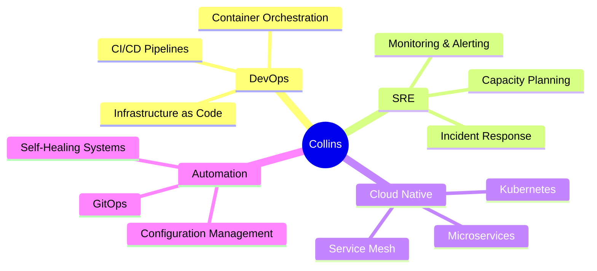

<!-- Animated Header Banner -->
<div align="center">
  
  <!-- Animated Typing SVG -->
  

</div>

<!-- Profile Section -->
<div align="center">
  
  ```ascii
  ╔════════════════════════════════════════════════════════════╗
  ║  🎯 DevOps & SRE  •  Software Engineer  •  Cloud Native  ║
  ╚════════════════════════════════════════════════════════════╝
  ```
  
  <p>
    
    
    
  </p>

</div>

---

### 🎨 About Me

```typescript
const collins = {
  role: ["DevOps Engineer", "SRE", "Software Engineer"],
  motto: "Automate Everything, Monitor Everything, Break Nothing",
  currentFocus: ["Kubernetes", "CI/CD", "Observability", "Infrastructure as Code"],
  funFact: "I treat infrastructure like code and code like infrastructure 🔄"
};
```

> 💡 **Tech Wisdom:** *"It's not a bug, it's an undocumented feature"* – Every DevOps Engineer

---

### 🛠️ Technology Arsenal

<!-- Backend & Languages -->
<details open>
<summary><b>⚡ Backend & Languages</b></summary>
<br/>
<p>
  
</p>
</details>

<!-- DevOps & Cloud -->
<details open>
<summary><b>☁️ DevOps & Cloud Platform</b></summary>
<br/>
<p>
  
</p>
<p>
  
</p>
</details>

<!-- Monitoring & Observability -->
<details open>
<summary><b>📊 Monitoring & Observability</b></summary>
<br/>
<p>
  
  
  
  
</p>
</details>

---

### 📊 GitHub Analytics

<div align="center">

<!-- Snake animation eating contributions -->
<picture>
  <source media="(prefers-color-scheme: dark)" srcset="https://raw.githubusercontent.com/cm-collins/cm-collins/output/github-contribution-grid-snake-dark.svg">
  <source media="(prefers-color-scheme: light)" srcset="https://raw.githubusercontent.com/cm-collins/cm-collins/output/github-contribution-grid-snake.svg">
  
</picture>

</div>

<!-- Current Account Stats -->
<details open>
<summary><b>🎯 Current Account (@cm-collins)</b></summary>
<br/>

<div align="center">
  
  <!-- Stats Cards -->
  
  

  <!-- Streak Stats -->
  

  <!-- Activity Graph -->
  

  <!-- Trophy Stats -->
  

</div>

</details>

<!-- Legacy Account Stats -->
<details>
<summary><b>📚 Legacy Account (@CollinsMunene-Developer)</b></summary>
<br/>

<div align="center">

  
  
  

  

</div>

</details>

---

### 🎯 Current Focus



---

### 📈 Contribution Activity

<!-- 3D Contribution Graph -->
<div align="center">
  
</div>

---

### 💼 What I Do

<table>
<tr>
<td width="50%">

**🏗️ Infrastructure**
- Design scalable cloud architectures
- Implement Infrastructure as Code
- Optimize resource utilization
- Ensure high availability

</td>
<td width="50%">

**🔄 Automation**
- Build CI/CD pipelines
- Automate deployments
- Create self-healing systems
- Streamline workflows

</td>
</tr>
<tr>
<td width="50%">

**📊 Observability**
- Monitor system health
- Set up alerting & dashboards
- Trace distributed systems
- Analyze metrics & logs

</td>
<td width="50%">

**🚀 Optimization**
- Improve performance
- Reduce costs
- Enhance reliability
- Scale efficiently

</td>
</tr>
</table>

---

### 🎓 Certifications & Learning

<div align="center">

```python
certifications = {
    "in_progress": ["AWS Solutions Architect", "CKA", "Terraform Associate"],
    "planned": ["CKAD", "Azure DevOps Engineer"],
    "learning": ["Service Mesh", "eBPF", "GitOps", "Platform Engineering"]
}
```

</div>

---

### 📫 Let's Connect

<div align="center">

[](mailto:dev-collins@outlook.com)
[](https://www.linkedin.com/in/collins-munene-547365299/)
[](https://x.com/collins63760613)

</div>

---

### 💭 Random Dev Quote

<div align="center">


</div>

---

### 📊 Profile Views & Stars

<div align="center">


</div>

---

<div align="center">
  
  ### 🎵 "Code is poetry, infrastructure is the stage, and DevOps is the performance" 🚀
  
  <sub>Last updated: 2025-09-30 • Built with ❤️ and ☕</sub>
  
  

</div>
